# CCIS-KSU (IS-326)
> Mathematical Modeling for IS Course - Assignment.

An implementation of Dijkstra’s shortest path algorithm in Java. The program accepts any graph from users and finds the shortest path.

## Test Cases

### **Test Case #1**:
#### Graph:
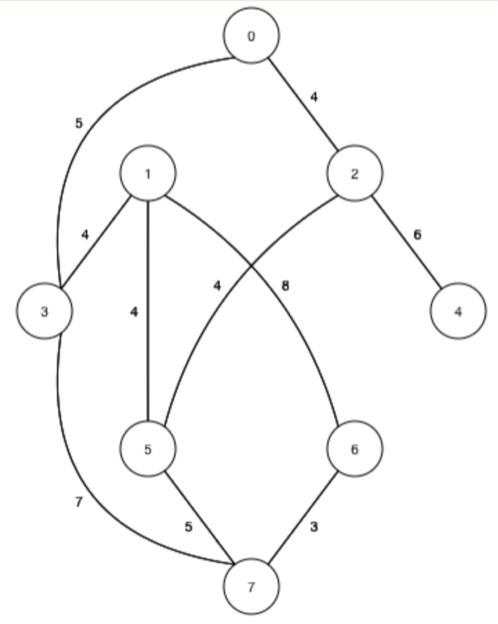
#### Graph's Result:
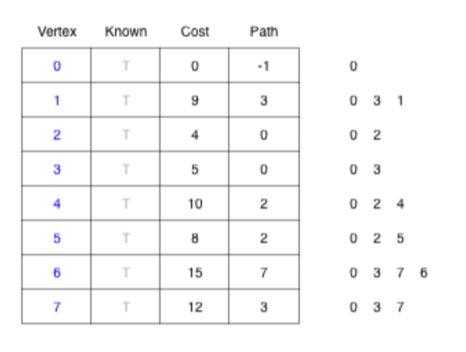
#### Input:
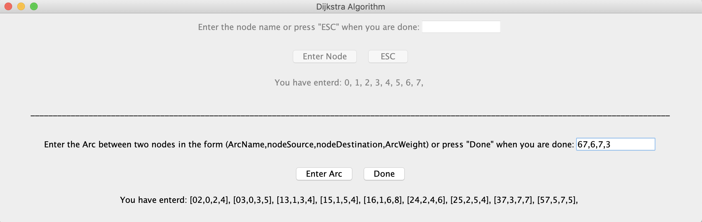
#### Output:
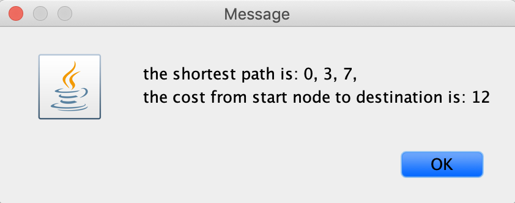
---
### **Test Case #2**:
#### Graph:
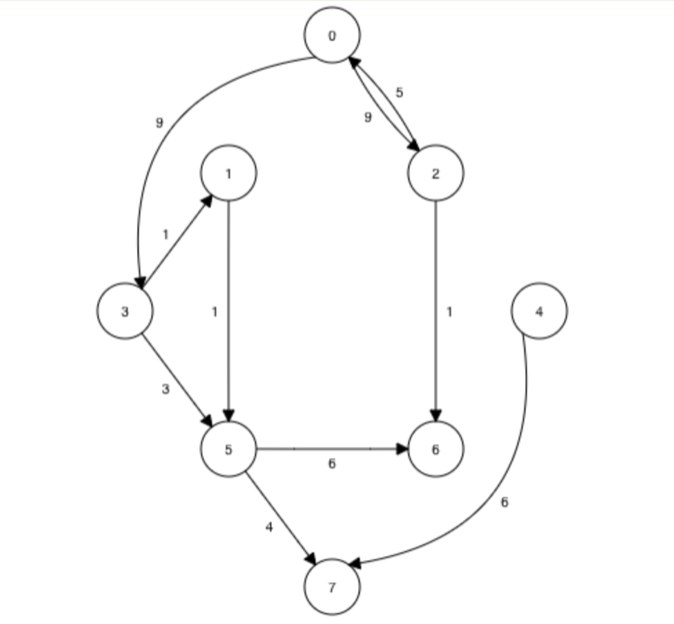
#### Graph's Result:
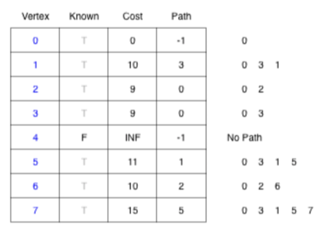
#### Input:
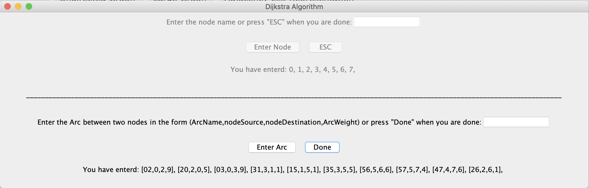
#### Output:
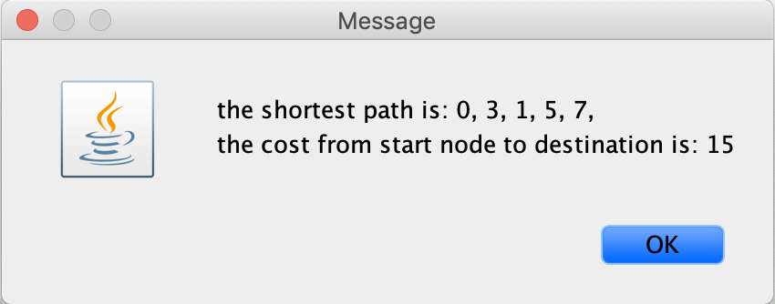
---
### **Test Case #3**:
#### Graph:
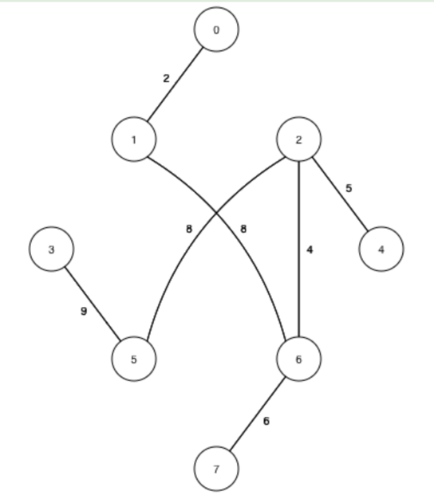
#### Graph's Result:
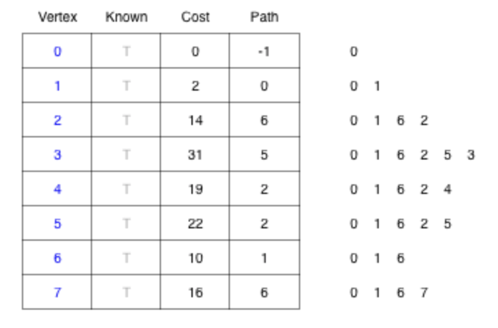
#### Input:
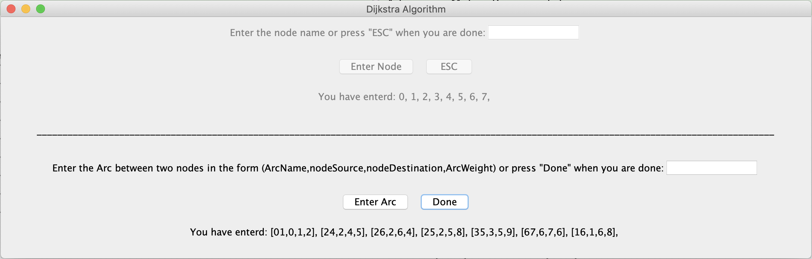
#### Output:

---
### **Test Case #4**:
#### Graph:
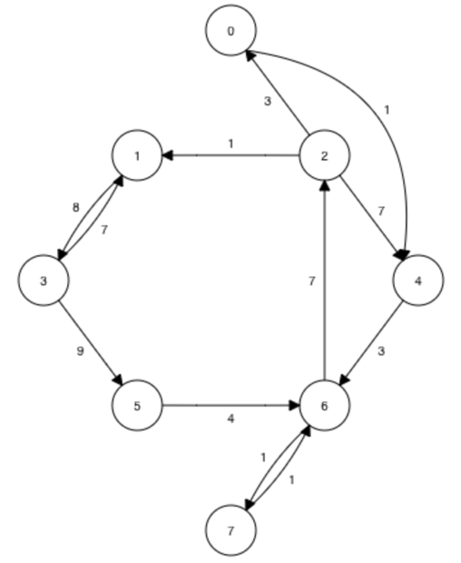
#### Graph's Result:
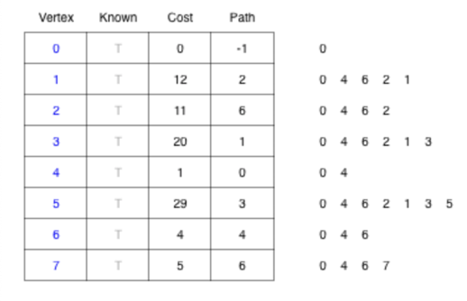
#### Input:
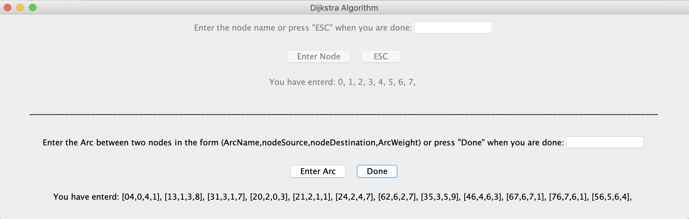
#### Output:
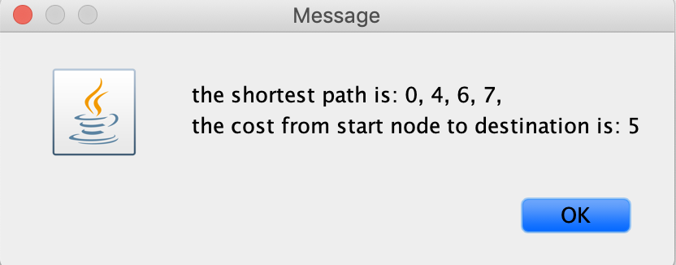